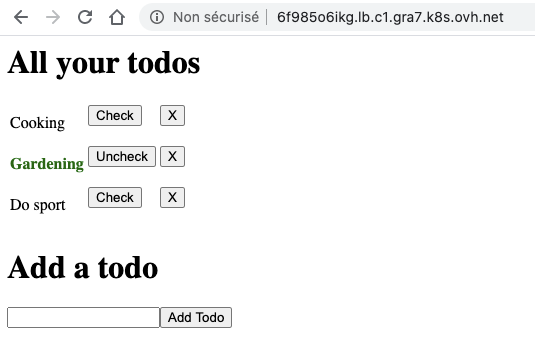

# NodeJS - MongoDB on K8s
## Basic todo app, CRUD, coded in TypeScipt 

To setup Visual Studio Code for Nodejs with TypeScript, with autoreload and VSCode debugging (breakpoints) : <br/>
https://github.com/dleurs/learn_nodejs_ts


```bash
$ kubectl get pod
NAME                                      READY   STATUS    RESTARTS   AGE
my-release-mongodb-6d7b4d57cf-9jpgp       1/1     Running   0          17h
nodejs-mongodb-ovh-6cc66c978-2b9tc        1/1     Running   0          20m
```

```bash
$ kubectl get svc
NAME                     TYPE           CLUSTER-IP     EXTERNAL-IP                         PORT(S)        AGE
kubernetes               ClusterIP      10.3.0.1       <none>                              443/TCP        8d
my-release-mongodb       ClusterIP      10.3.146.86    <none>                              27017/TCP      17h
nodejs-mongodb-ovh-svc   LoadBalancer   10.3.183.150   6f985o6ikg.lb.c1.gra7.k8s.ovh.net   80:31861/TCP   19m
```




## Some command I used in this project 

helm install my-release bitnami/mongodb
export MONGODB_ROOT_PASSWORD=$(kubectl get secret --namespace default my-release-mongodb -o jsonpath="{.data.mongodb-root-password}" | base64 --decode)

Wait for next command to work :
kubectl run --namespace default my-release-mongodb-client --rm --tty -i --restart='Never' --image docker.io/bitnami/mongodb:4.2.8-debian-10-r7 --command -- mongo admin --host my-release-mongodb --authenticationDatabase admin -u root -p $MONGODB_ROOT_PASSWORD

docker build -t dleurs/nodejs-mongodb-ovh:1.1.2 .

docker push dleurs/nodejs-mongodb-ovh:1.1.2

kubectl create k8s/deploy-and-loadbalancer.yaml

kubectl get svc

kubectl run --namespace default testing-nodejs-app --rm --tty -i --restart='Never' --image curlimages/curl --command -- curl -v 10.3.1.201

Wait for external IP
